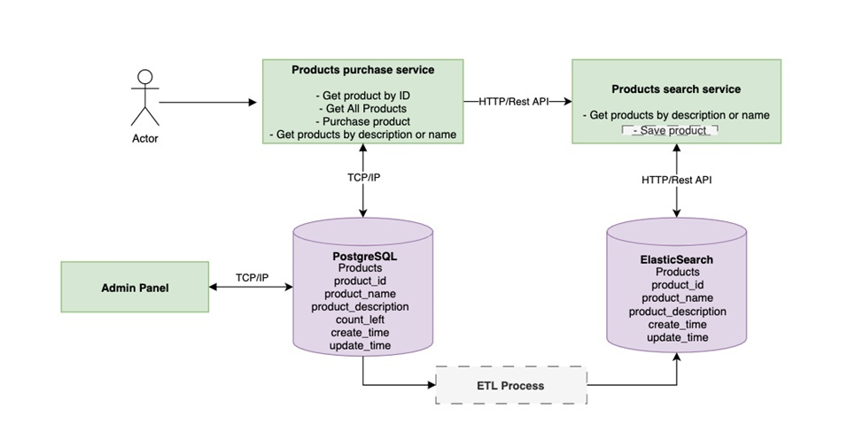

Задание

Разработать проект, предоставляющий api для взаимодействия с продуктами: получение информации по id, получение списка продуктов, приобретение продуктов, поиск продуктов по названию/описанию. Проект должны состоять из нескольких отдельных сервисов согласно схеме:

 

Сервис Products purchase должен включать следующие API эндпоинты:
-	Получить информацию о продукте по ID
-	Получить список всех продуктов
-	Приобрести продукт (по ID)
-	Получить список продуктов по названию или описанию (обращается к отдельному сервису поиска)
Сервис Products search:
- Получить список продуктов по описанию/названию, либо по тому и другому

ETL процесс с заданной периодичностью перекладывает новые и обновленные данные из PostgeSQL в ElasticSearch

Панель администратора (Admin Panel) используется для добавления новых товаров и обновления существующих

Требования:
-	Сервисы и базы данных описаны в едином docker-compose файле
-	Переменные окружения вынесены в .env файле (в репозитории должен быть файл .env.example)
-	БД в docker-compose для инициализации использует переменные из .env файла
-	В проекте есть файл requirements.txt со списком всех библиотек проекта

В проекте желательно стараться разделять слои (БД, api, бизнес логика).

